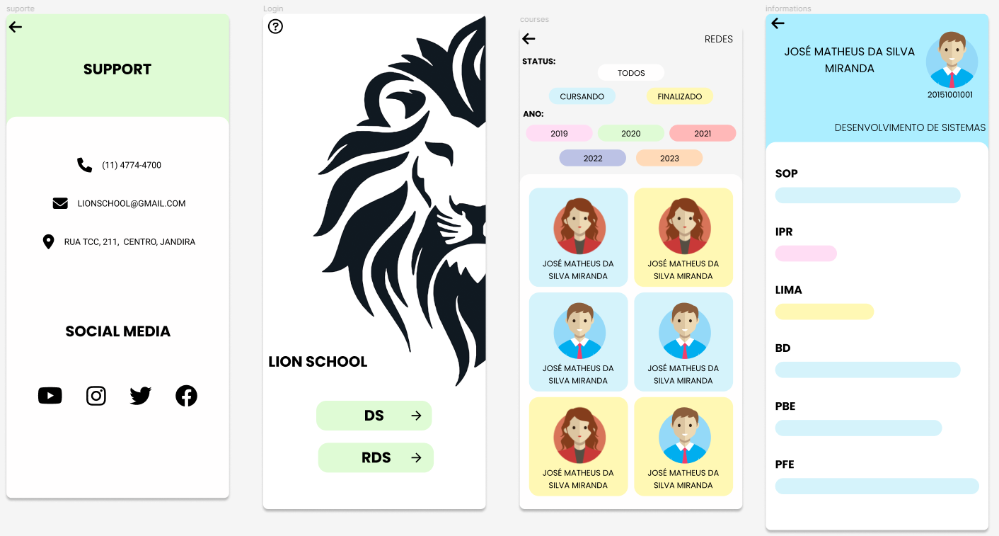

# 
LION SCHOOL MOBILE

   
   <h1>SUMÁRIO</h1>

<!-- -  [TO DO LIST](#to-do-list) -->
-  [TECNOLOGIAS APLICADAS](#tecnologias-aplicadas)
-  [FERRAMENTAS](#ferramentas)
-  [COLABORADORES](#colaboradores)
   

  
   <h1>SOBRE</h1>   

A atividade tem como objetivo integrar as disciplinas de INDMO (Programação interface de dispositivos móveis) e PWBE (Programação web Back-end) e do curso de desenvolvimento de sistemas do SENAI Jandira.
O projeto é o gerenciamento da escola Lion School, deverá ser realizado tanto o back-end como o mobile.

  
   <h1>DESIGN</h1>   

O Layout deste app foi baseado no Figma. 

[Link do Figma](https://www.figma.com/file/KsNq9fEu4NCMIsksObZdqx/Lion-School-(Resposividade)-(Copy)?type=design&node-id=0-1&t=ffo1qC3h1Ujyr4eA-0)

<!-- 

   
   <h1>TO DO LIST:</h1>   

- [x] Criou layout conforme designer feito no Figma?
- [x] Os botões dos cursos são dinâmicos?
- [x] Os cards são criados dinamicamente?
- [x] A página com informações dos cursos foi criada dinamicamente?
- [X] O filtro por status está funcional?
- [x] Os nomes das variáveis, funções e arquivos tem valor semântico?
- [x] A maioria das funções seguem as boas práticas como responsabilidade única?
- [x] Foi criado o layout responsivo no Figma?
- [x] Foi implementado a responsividade conforme planejado no Figma?
- [ ] Foi criado o filtro por ano? -->

   <h1>TECNOLOGIAS APLICADAS</h1>   

- KOTLIN

<h1>FERRAMENTAS</h1> 
       

   
   <h1>COLABORADORA</h1>   

| NOMES                                                                                                                                                                                      |                                               GITHUB                                               |                                       FOTO                                        |
| :----------------------------------------------------------------------------------------------------------------------------------------------------------------------------------------- | :------------------------------------------------------------------------------------------------: | :-------------------------------------------------------------------------------: |
|  |  | </a>  |
